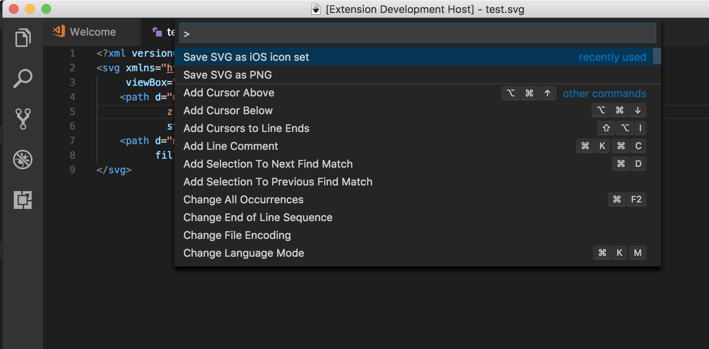
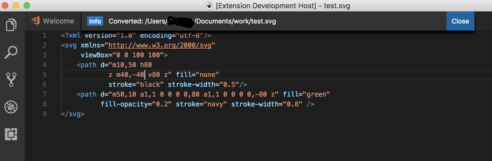
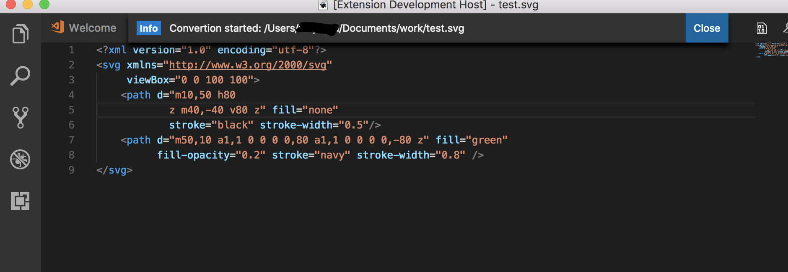
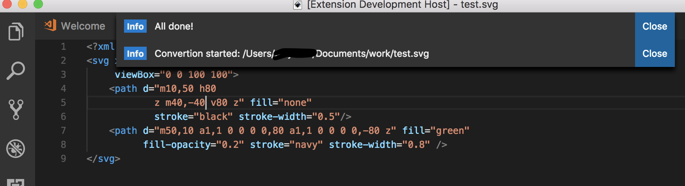

# What's new for v1.1.0

This version have some bugs fixed:

- A SVG file without the xml declaration is now supported.
- A SVG file without the namespace URI is now supported.
- The single save function now look at the `width` and `height` attribute of the `svg` tag if they exists. Only in case when they does not exist, it will look at the `viewBox` attribute instead.

# Use SVG for your app assets source

**svgasset** is a simple extension allows you save any SVG files to PNG file. Right now, it ships with two basic commands:

- Use `Save SVG as PNG` command to save the editing SVG to PNG file. It uses the view box width and height as the image size.

- Use `Save SVG as iOS icon set` command to save a set of PNG files that is good for iOS app icons. This will create 18 PNG files in total.

## Features

For example if there is an image subfolder under your extension project workspace:

Once the "Save SVG as PNG" command completed, the folloeinh message shows:

The "Save SVG as iOS icon set" command will take a while, so it shows the following message to indicate the start of process:

When it finishes, another message is shown:

## Requirements

This extension does not require anything. Only your Visual Studio Code!

## Extension Settings

In the future I would consider adding some settings, but right now, there is not.

## Release Notes

### 1.0.0

Yay, we have a new comming! This version is basic but includes some important features: from SVG file generate all necessory PNG files needed for you iOS app.
